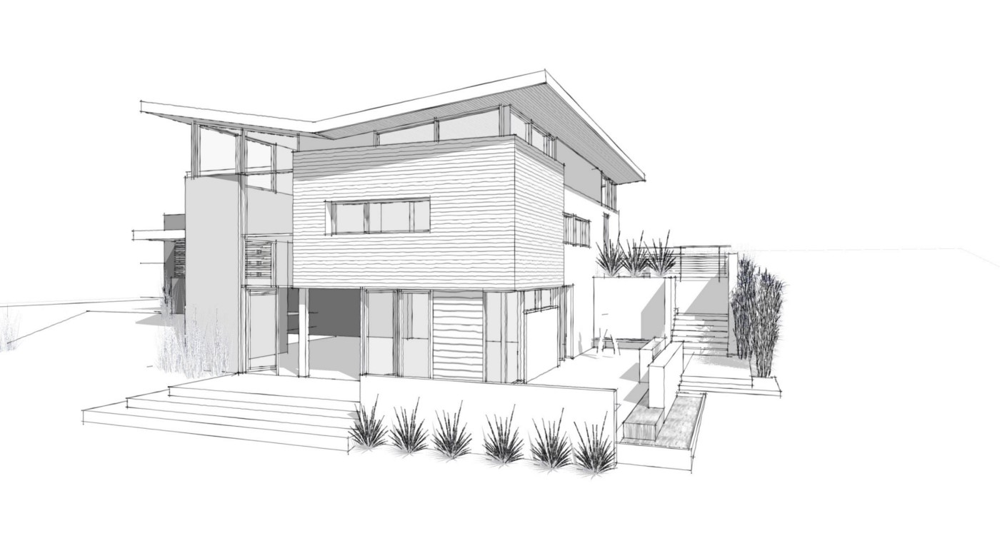

# Abstraction (Soyutlama)

> Bu yazı @tarikguney'in https://medium.com/@atarikguney/abstraction-ve-encapsulation-tam-olarak-nedir-27b9aae99e56 adresindeki makalesinden alınmıştır

Ne kadar da çok çıkıyor karşımıza bu iki kavram yazılım hayatımız boyunca. Hemen hemen her mülakatın, özellikle de OOP kullanan şirketlerin devamlı sorduğu sorulardandır abstraction ve encapsulation kavramlarının ne oldukları ve aralarında ki farklar. Bu kadar çok sorulması, bu kavramları değersizleştiren ve sıradanlaştıran bir sorun olarak görülmesin. Çoğu insan terimleri kavramsal düzeyde bilmiyor. Genelde implementasyon açılarından biliyorlar. Mesela, abstraction nedir diye sorun: Sınıfları, arayüzler arkasında saklamaktır… diye cevap alırsınız. Hatta daha somut şekilde bile cevaplar gelir: Arayüzler bir soyutlamadır. Geçenlerde bir mülakatta kendisine Dependency Injection nedir diye sorduğum senior bir mühendis bana Spring framework içinde sınıfların nasıl inject edildiğinden bahsetmeye başladı. Anlaşılan ilk defa DI ile orada tanıştı ve bunu formülize edip ortaya genel bir kavram çıkaramadı. Terimler, kendilerini oluşturan sebep ve sonuçlar zaviyesinden anlaşılmayınca, bu şekilde ki cevaplar kaçınılmaz oluyor. Bana insanı anlat deyince, yakın arkadaşı Ali’yi anlatması ve onunla ne kadar da iyi zaman geçirdiğinden bahsetmesi gibi bir durum bu aslında.

## Nedir Abstraction
Yazılım kariyerim boyunca keşfettiğim en değerli şeyin abstraction olmasından dolayı, ondan başlayacağım anlatmaya. Yazılımda ki manasını bir kenarı koyalım. Nedir aslında abstraction? Kainatta ki tüm varlığın üzerine bina edildiği bir kavramdır o. Varlığı anlamamızı mümkün kılan müthiş bir olay abstraction. Kullandığınız her kelimeyi ve hissettiğiniz her varlığı çepeçevre sarmıştır aslında. Halbuki ne kadar da az biliniyor değeri! İlimler abstraction sayesinde var oldu. İnsanoğlu abstraction sayesinde devamlı gelişti. En büyük aşkların arkasında abstraction vardı. Çocuğunuza karşı hissetiğiniz o tanımsız şefkat ve sevgiyi sımsıcak kolları ile sarmalayan abstraction’tan başkası değildi. Eğer abstration olmasaydı, şu an sizinle burada konuşamıyor olurduk… Hayat söner, varlık yok olur, ve mânâ anlamsızlaşmaya başlardı.

Bu kadar önemli olayların arkadasında ki bu kavramın aslında çok basit bir tanımı var: Bir varlık ya da sistemi incelerken, fiziksel, mekansal, ve zamansal nitelikleri içinden ilgimizi çekmeyen kısımları ayıklamak sureti ile sadece işimize yarayan kısımlara odaklanmak. Abstraction olmasaydı matematikte hiç bir formül hayat bulamazdı. Genellemeler yapamaz, varlığı anlayamaz ve kaybolur giderdik. Sanat var olmazdı. Ne kaldı ki geriye?

Şimdiye kadar soyut düzlemde anlattığım herşeyi somut akla indirgemek için bir örnek vereyim. Türkler… kelimesi bir soyutlamadır. Altına milyonlarca insan girer. Ama bireysel temelde birbirlerinden yüzlerce hatta binlerce farkı olan bu insanların, ortak olan bazı taraflarını almak sureti ile onları kategorize etmek, işte bu bir abstractiondır. Daha açık konuşmak gerekirse, aynı coğrafya, dil, ve kültürü paylaşmalarını alıp, diğer tüm taraflarını göz ardı etmektir buradaki abstraction. Türkler deyince hanginizin aklına bu insanların aslında hepsinde ortak olan diğer özellikler geldi? Mesela hepsinin bağırsaklarının olması, hepsinin böbreklere sahip olması, yemek yerlerken tükürük bezlerinden salgılanan kimyasallar ile nişastayı daha ağızlarından itibaren sindirime başlamaları… hanginizin aklına bunlar geldi?

Peki abstraction ile sahip olduğumuz bu güç aslında hiç var olmasaydı? Türkler demek sureti ile bir kelime ile anlatabildiğiniz bir kavramı söylemek için ne kadar da çok şey söylemeniz gerekirdi, farkında mısınız?. Hatta o çok şey bile aslında başka abstraction ifadelerden oluşacağı için, konuşmanız imkansız hale gelirdi. Hatta düşünemez olurduk. İlim böyle bir şey aslında. Avam bir insan ile alim bir insanın Türk kelimesinden anlayacağı şeyler çok farklı olacaktır. Soyut bir kavramın arkasında ki hakikatleri ne kadar çok bilirseniz, o kadar bilgilisiniz demektir. Avam bir insan, Türk kelimesini duyunca, kendi köyünde, şehrinde, ülkesinde yaşayanlar ve beraber döner yedikleri insanları görür. Alim ise onların sosyo-kültürel ve sosyo-ekonomik benzerliklerini, tarihlerini, kültürel referanslarında ki ortaklıklarını, dillerini, bakış açılarını, vs. görür ve bunlar üzerinden yorumlarını yapar. Bir kitap, şimşeklerden bahsederken, onları bulutları aşılayan ve yağmur yağmasına neden olan bir olay olarak anlatır; bundan ben, çamaşırlar ıslanacak, gideyim de toplayayım manasını çıkarırım, bir alim ise bundan atomları, eletronları, bulutların dinamiğini, vs. görür ve mest olur. İşte okumak ve öğrenmek her gün karşımızda abstract (soyut) olarak boy gösteren olayların arkası dediğimiz implementasyon detaylarını anlamak içindir. Ellerimi her gün yıkadığım ve bana göre tek kullanım amacı temizlik ve bolca köpürmek olan sabunun, çalışma mantığını anladığım zaman, varlığını bile göremediğim küçük parçacıkların bu kadar akıllı bir çalışma mekaniğine sahip olması karşısında hayranlığımı ve heyecanımı gizlebildiğimi zannetmiyorum.

En büyük aşklar bile abstraction sayesinde var olur dedim. Hanginiz sevdiğine bakarken, midesini, böbreklerini, alyuvarlarını, su içerken yemek borusundan suyun akıp sindirimine karışmasını, vs. görüyor ve bunlara aşık oluyor? Ya da kaçınız onu bu özelliklerinden soyutlayıp, güzel konuşmasına, gülümsemesine, bakışlarına bakarak seviyor?

Bir cekete bakın. İçinde ki ipliği, düğmeleri, dokuması, boyası, cepleri, vs. ile aslında onlarca ve yüzlerce küçük ve birbirleri ile tamamen alakasız parçalardan oluşuyor. Ama hepsi bir amaç uğruna bir araya geliyor. Bizler de, uğruna bir araya geldikleri bu amaç açısından onlara bakıyor ve tüm bu parçalara bir isim veriyoruz: Ceket. Bu mantığı çok iyi anlayın. Çünkü bu ufacık paragrafta anlattığım mantık, abstraction’ın yazılımda ne manaya geldiğini anlatıyor. Bir spor takımının taraftarlarına bakın. Hepsi farklı hikayelerin bambaşka oyuncuları aslında. Ama ortak bir hedefleri var: Takımlarının başarılı olmaları. Paylaştıkları bu ortak noktadan bu insanları inceliyor, farklılıklarını ve diğer benzerliklerini bir kenarı koyuyor, ve hedeflerinin ortaklığından dolayı onlara taraftar diyoruz. Çünkü onlar takımlarının kazanmasına taraftarlar…



Yukarıda ki resme bakın. Ev ile alakalı binlerce detayın silinip, sadece belli bir kısmını göstermek ile çizildiğini göreceksiniz. Böyle olmasa resim çizebilir miyiz?


Harflere bakın. Onlar aslında seslerin birer soyutlamasıdır. “A” sesini çıkarırken, ses tellerimizin sebep olduğunu titreşimlerin havanın titreşmesiyle ilerleyip kulak zarımıza çarpıp, sonra beynimize elektrik sinyalleri olarak giden tüm bu mekanik olayın en yalın soyutlamasıdır belki “A” ve “a” harfleri. Meydana gelen bu tüm fiziksel olayların varlık amacında ki ortak noktalardan bir tanesi A sesinin var olmasıdır. Biz de onu A harfi ile kağıt üzerinde aslında bir resim olarak gösteriyoruz.

Araba kullanmanıza bir bakın: Bir direksiyon, iki pedal, ve bir vites. Arkada çalışan onca parçanın ortak noktası işte bunlar. Yüzlerce parçanın var olma amacı, bizim görebildiğimiz gaz ve frenin çalışmasını sağlamak. Dolayısıyla bir kaç parça ile soyutlanmış devasa bir mühendislik harikası… Ya da tüm bunları göz ardı edip, güç açısından bakabilirsiniz. Bir at ile bir motor arasında ki benzerlikler güçtür. Birisi bir beygir gücünde, diğer 150.

Her gün kullandığımız dürüstlük, ahlak, terbiye gibi ifadeler aslında kendilerini oluşturan onlarca davranışın ortak noktasını anlatan soyutlamalardır.

Daha binlerce, yüzbinlerce, milyonlarca örnek her an yanımızdan ve içimizden geçip gidiyor. Ne kadar müthiş, ne kadar sade, ne kadar alçak gönüllü, ne kadar hayattar, ne kadar muhteşem bir kavramdır abstraction. Ne kadar vefalı bir dost ve ne kadar sağlam bir omuz.

## Yazılımda Abstraction
Yazılımcılar olarak bizlerin kullandığı abstraction ise şimdiye kadar anlattıklarımın içinde küçücük bir yer alıyor. Farklı katmanlar içinde soyutlamanın kullanılmadığı hemen hemen hiç bir yer yok gibidir. Çok basit bir örnek vereyim. Sizce aşağıda ki bir satırlık bir kod abstraction içerir mi? Durun ve şimdiye kadar anlattıklarım ile olaya bakın:

```
string hello = "world";
```

Yukarıda hiç interface yok, ya da class, ya da inheritance. Ama abstraction dağ gibi duruyor tam orada. Hem de birden fazla. Bunu üzerine saatlerce konuşabilirim. Ama kısa anlatmaya çalışayım:

`string` bir soyutlamadır. Çünkü string beklentisi ile çalışan verileri soyutlar. Mesela memory içinde nasıl saklanacakları, nasıl okunacakları, diğer veriler ile nasıl etkileşime geçecekleri, operatörlere nasıl tepki verecekleri gibi tüm bu beklentilerin ortak kısmını ifade eder. Bunlar gibi farklı açılardan bir karakter dizisinden beklenenler string olarak soyutlanmıştır. Bunlara davranışsal soyutlama nedir. Çünkü farklı varlıkların ortak davranışlarının ele alınması ile ortaya çıkan soyutlamalar ile ilgilenir.
hello bir soyutlamadır. Memory adresini soyutlar. Verini nasıl saklanması gerektiği ve nerede saklanacağı gibi adımları soyutlar. Unutmayın: Alt tarafta çalışan farklı olsalar bile tüm bu kodların bir amacı vardır ve o da hello değişkenin bir memory adresine dönüşmesi ve kendisinin diğer yerlerde referans gösterilmesidir, vs.
`=` bir soyutlamadır. Bir verinin atanması adımlarını soyutlar.
`“world”` bir soyutlamadır. Kendisini var eden tüm kodları soyutlar, kendisinin saklanması için kullanılan 010101 soyutlar, oluşturulma ve saklanma sürecini soyutlar.

Başka bir koda bakalım.

```
function createAccount(account){
  var eligableForCreation = account.age > 18 && account.country === "USA"
  if(eligableForCreation){
    this.pushAccountToCosmosDb(account);
  }else{
    console.log("account is not eligable for opening");
  }
}
```

Sizce `createAccount()` fonksiyonu ve eligableForCreation değişkeni bir abstraction mı? Evet. `createAccount()` içinde ki tüm adımlar ilk bakışta birbirlerinden farklı gözükseler bile aslında ortak bir amaç uğrunda oradalar: Yeni bir hesap oluşturmak. Dolayısıyla amaçlarındaki ortaklığı alıp, diğer kısımları göz ardı etmenin adıdır `createAccount()` fonksiyonu. Bir ceketi oluşturan parçalar gibi. Benzer şekilde `eligableForCreation` değişkeni kendisine oluşturan parçaların ortak amacını temsil eder. Yaşın 18 den büyük olması ve yaşanılan ülkenin USA olması, hesabı açabilmek demektir.

Genelde davranışsal ve amaçsal soyutlamalar karşımıza çok çıkar bu tür kodlarda. Ama kalıtım girince, başka soyutlama katmanlarında, farklı soyutlama çeşitleri ortaya çıkabilir:

```
class Animal{
  public int Length {set;get;}
  public string Gender {get;set;}
}
class Dog: Animal{
  public int TailLength {get;set;}
}
class Dolphin: Animal{
  public string SpeedInWater {get;set;}
}
```

Yukarıda uydurduğum sınıflarda, Animal daha çok karakteristik bir abstraction sağlıyor. Köpek ve Yunus karaketlerinin daha specific kısımlarını göz ardı edip, her ikisinde de ortak olan uzunluk ve cinsiyet gibi kısımları ortaya sunuyor. Ama aşağıdaki örnekte daha çok davranısşal ve fonksiyonel bir abstraction göreceksiniz:

```
interface IAnimal{
  public void Move();
}
class Dog: Animal{
  public void Run();
}
class Dolphin: Animal{
  public void Swim();
}
```

Bunları yaparken, hitap ettiğiniz asıl kitle, bu sınıfları kullacak olan diğer insanlar. Arabalarda ki gaz ve fren gibi kısımlar ile soyutlanan binlerce parça, arabayı nasıl daha kolay kullanılabilir hale getirdiyse, yazılımda da abstraction benzer etkiyi hem sizin için hem de sınıflarınızı kullanacak diğer mühendisler için yapar. Eğer mühendisler, arabanın nasıl çalıştığını bildiklerinden dolayı, onları üretirken herkesi kendileri gibi düşünüyor olsalardı, o zaman araba süren insan sayısı şimdikinin sizce kaçta kaçı kadar olurdu? Benzer şekilde, eğer yazılımda, abstraction çok gelişmiş bir konsept olmasaydı, şu an çoğumuzun 010101 diye kod yazıyor olurduk. Ya da biraz daha ileri gidelim, assembly ile can çekişmek zorunda kalırdık.

Özetlemek gerekirse: Farklı kod parçalarının kompleks kısımlarını, sahip oldukları ortak davranışlar, amaçlar, karakteristik özellikler arkasında saklamak sayesinde daha anlaşılır ve kolay kullanılabilir kod yazmaktır abstraction.

## Bir de Encapsulation vardı!
Abstraction dışarıdan bakan içindir demiştik. Encapsulation ise tam tersi. Encapsulation, motor üreticilerinin onu kaporta ve motor kapakları ile koruma içgüdüsüdür. Encapsulation evlerimizde ki kapı ve perdelerdir. Encapsulation beynimizi çevreleyen kafatasıdır. Encapsulation, sınıfımızı başkalarının yanlış kullanımlarımdan korumak için kontrolsüz değişime kapamaktır. Sınıfımızın içeriğini deterministic tutabilmek için koruruz onu. Aşağıda ki örneği bir inceleyin, yeterli olacaktır.

```
class AccountCreator{
  public int Age;
  private string _country;
  
  public void CreateAccount(Account account){
    this.Age = account.Age;
    // Simulate some long running task with Thread.Sleep
    Thread.Sleep(10000);
    this._country = account.Country;
    var accountEligible = CheckAge();
  } 
  
  private bool CheckAge(){
    if(_country == "USA"){
      this.Age++;
      return this.Age > 18;
    }
  }
}
static void Main(string[] args){
  var accountCreator = new AccountCreator();
  var account = getAccountFromAzure();
  accountCreator.CreateAccount(account);
  // Hmmm, not sure what this Age field does, better to set it with something else...
  accountCreator.Age = 16;
  // Boom!
}
```
